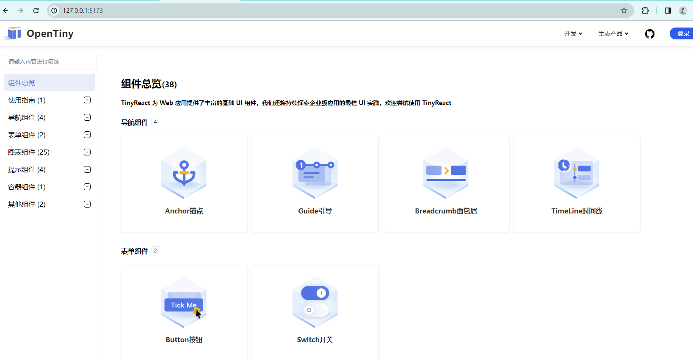

# TinyReact 组件库说明文档
## 软件基本信息
### 标题
* TinyReact 组件库

### 摘要
TinyReact 组件库是一个基于 React 的企业级 UI 组件库，旨在通过复用 TinyVue 的跨技术栈架构和无渲染逻辑，为 React 社区提供一套功能丰富、性能优越的组件集。

### 软件分类
UI 组件库 / React 组件库

### 应用领域
适用于所有基于 React 的 Web 开发项目，包括企业级应用、个人项目以及复杂界面的构建。

### 开放源码许可证类型
[MIT](LICENSE)
## 作品概述
### 项目背景
随着前端技术的不断发展，跨技术栈开发成为了一种趋势。TinyVue 作为 OpenTiny 社区的企业级 UI 组件库，已经在 Vue 社区中得到了广泛应用。为了满足 React 社区对类似组件库的需求，本项目旨在通过复用 TinyVue 的跨技术栈架构和无渲染逻辑，开发出 TinyReact 组件库。

### 应用领域
TinyReact 组件库适用于所有基于 React 的 Web 开发项目，能够助力开发者快速构建出美观且功能丰富的界面。

### 设计思路
本项目的设计思路主要包括以下两个方面：

1. 跨技术栈适配：通过开发 react-common 适配层，抹平 React 技术栈和 Vue 技术栈之间的差异，实现跨技术栈的组件复用。
2. 模板转换：将 TinyVue 的模板转换成 React 对应的函数组件文件，以便在 React 项目中直接使用。
### 功能特点
* 丰富的组件库：包含 alert、anchor、badge、breadcrubm、button、chart、divider、drawer、float-button、guide、switch、tag、tooltip 等多种常用组件。
* 高性能：复用 TinyVue 的无渲染逻辑，提高组件的渲染性能。
* 易用性：提供清晰的文档和示例，方便开发者快速上手和使用。
### 体系架构
TinyReact 组件库采用模块化设计，每个组件都是一个独立的模块，方便扩展和维护。同时，采用了现代化的前端构建工具和技术，确保组件的稳定性和性能。

### 关键技术
* React：TinyReact 组件库基于 React 构建，充分利用了 React 的声明式编程和组件化思想。
* TinyVue 跨技术栈架构：通过复用 TinyVue 的跨技术栈架构，实现 React 和 Vue 组件的共享。
* Renderless 无渲染逻辑：复用 TinyVue 的无渲染逻辑，提高组件的复用性和可维护性。
##  运行命令
开发者可以通过执行 pnpm run dev:react 命令来启动 TinyReact 组件库的开发环境，并实时预览和调试组件库的效果。同时，也提供了详细的文档和示例，方便开发者快速上手和使用。
- Clone 个人仓库到本地
- 在根目录下运行 `pnpm i`, 安装 node 依赖
- 运行 ` pnpm run dev:react`，启动组件库网站。并实时预览和调试组件库的效果。同时，也提供了详细的文档和示例，方便开发者快速上手和使用
- 打开浏览器访问：[http://127.0.0.1:5173/](http://127.0.0.1:5173/)

```shell
# 克隆代码
git clone https://atomgit.com/opentiny/000009.git
cd 000009

# 安装依赖
pnpm i

# 启动 react 项目
pnpm run dev:react
或
pnpm dev:react
```
看到如下页面代表运行成功

## 项目目录


### 打包 react 相关

```b
internals/cli
    /build
        /build-entry-react.ts (packages/react 目录下生成入口)
        /build-ui-react.ts   (packages/dist-react 下生成打包产物)
    /create
        /create-mapping-react.ts (packages 下生成构建任务列表 modules.json)
        /common-mapping-react.json (定义一些公共的打包任务，如 react-common)
```

### 开发 react 模版文件相关

packages/react/src/[compName] 目录

一个组件模版的目录结构如下

```b
alert
    /node_modules
    /src
        /index.ts
        /pc.tsx
        /mobile.tsx
        /mobile-first.ts
    /index.ts
    /package.json
```
alert/index 是组件入口
pc、mobile、mobile-first 是三套模版

### 开发 react-icon 相关

packages/react-icon/src/[svgName] 目录

一个 svg 直接用一个 index.ts 创建

如：packages/react-icon/src/add/index.ts

```ts
import { Svg } from '@opentiny/react-common'
import { ReactComponent as AddLoading } from '@opentiny/vue-theme/svgs/add.svg'

export default Svg({ name: 'AddLoading', component: AddLoading })
```

### 开发 react-common react 适配层相关

react-common 的目录如下，主要是适配层的文件

```b
packages/react-common
    /src
        /csscls.ts 操作样式类名的一些方法
        /event.ts 模拟 vue 事件系统
        /fiber.ts 对 fiber 的一些读取操作
        /reactive.ts 实现数据响应式
        /resolveProps.js 从 react 的 props 上解析事件或属性
        /svg-render.jsx 渲染 svg 组件的公共函数
        /utils.ts 工具函数
        /virtual-comp.jsx 虚拟组件，用于实现 vue 的指令系统
        /vm.js 用户模拟 vue 的 vm 对象
        /vue-hooks.js 用户模拟 vue 的钩子函数
```

### 示例文档相关
1.   
```b
examples/react-docs/src/view
    /overiview.jsx 组件总览
    /layout/layout.jsx 总菜单页
    /docs/docs.jsx 使用指南
    /examples/react-docs/src/view/components/
        components.jsx 组件
        readMarkdown.tsx 转化markdown文档
        lazyComponent.jsx 动态读取每个组件示例代码（一般是jsx或者tsx文件）
        renderTable.jsx 渲染Api为表格
```
2. 
```b
examplec/react-docs/demos
    /apis/[compName] 各个组件的api
    /overviewimage 各个组件的图片
    /pc/app/[comName]/webdoc  写各个组件的demo，记录了示例代码所在的文件夹，在上一层目录
    /webdosc 记录了使用指南对应的markdown文档
    /menus.js 目录文件
```
## 一些关键代码解释
1. 实现vue的$emit功能，使用的是props.listeners

common中代码
```javascript
const vm = {
    $emit:(type,...args)=>{
        if (props.listeners) {
            const callback = type in props.listeners ? props.listeners[type] : () => { }
            callback.apply(null, args)
        }
    }
}
```
某个组件例如Button代码
```jsx
import { Button } from '@opentiny/react'

export default function App(){
    const listeners = {
        click(){
            console.log('Button按钮被点击了！')
        }
    }
    return <Button listeners={listeners}>按钮</Button>
}

```
2. 实现vue的插槽功能

如果是default，直接使用props.children；如果name是其他的，就类似于如下写法

virtual-comp.jsx
```jsx
export function Slot(props) {
  const { name = 'default', slots = {}, parent_children } = props

  const EmptySlot = () => ''
  const S = slots[name] || EmptySlot
  return (
    <If v-if={defaultVIfAsTrue(props)}>
      <If v-if={name === 'default'}>{parent_children || props.children}</If>
      <If v-if={name !== 'default'}>
        <If v-if={S !== EmptySlot}>
          <S {...props} />
        </If>
        <If v-if={S === EmptySlot}>{props.children}</If>
      </If>
    </If>
  )
}
```
使用Slot
```jsx
<Slot name="top" slots={props.slots}>
    <div>如果props.slots里面没有top，将显示这个内容</div>
</Slot>
```

3. 实现vue的v-if功能

在react中，如果某一个dom需要在特定条件下才渲染，一般是下面的写法
```jsx
export default function App(props){
    return props.visible && <div>props.visible的时候才显示这段文字</div> 
}

```
如果要和vue一样使用v-if，可以使用如下方法

virtual-comp.jsx
```jsx
export function If(props) {
  if (props['v-if']) {
    return props.children
  } else {
    return ''
  }
}
```
使用If
```jsx
export default function App(props){
    return <If v-if={props.visible}><div>props.visible的时候才显示这段文字</div> </If> 
}

```

4. 实现响应式数据

利用的是react一个特性，就是一个数据若是改变，整个组件会重新渲染

common代码
```js
import { reactive, watch } from '@vue/runtime-core'

const reload = () => $bus.emit('event:reload')
 function toPageLoad(reactiveHook, reload) {
    return function (...args) {
      const result = reactiveHook(...args)
      nextTick(() => {
        watch(
          result,
          () => {
            typeof reload === 'function' && reload()
          },
          {
            flush: 'sync'
          }
        )
      })
      return result
    }
  }
export const reactiveWithReload = toPageLoad(reactive, reload) 
```
使用<code>reactiveWithReload</code>e创建响应式数据
```js
const data = reactiveWithReload({name:'default'})
```
这样data发生改变的时候会触发react重新渲染

5. 实现vue的生命周期

``` js
import {nextTick} from '@vue/runtime-core'

const $bus = useOnceResult(() => eventBus())// useOnceResult,就是保证只执行一次的函数
 // 刷新逻辑
const reload = useReload()
function useReload() {
  const [_, reload] = useState(0)
  return () => reload((pre) => pre + 1)
}
const eventBus = () => {
  const $bus = {}
// 挂载eventName对应的函数
  const on = (eventName, callback) => {
    if (!$bus[eventName]) {
      $bus[eventName] = []
    }

    $bus[eventName].push(callback)
  }
// 将eventName里面对应的函数给移除
  const off = (eventName, callback) => {
    if (!$bus[eventName]) {
      return
    }

    $bus[eventName] = $bus[eventName].filter((subscriber) => subscriber !== callback)
  }
// 执行eventName对应的函数
  const emit = (eventName, ...args) => {
    if (!$bus[eventName]) {
      return
    }

    $bus[eventName].forEach((subscriber) => subscriber && subscriber(...args))
  }
// 执行一次后移除
  const once = (eventName, callback) => {
    const onceCallBack = (...args) => {
      callback(...args)
      off(eventName, onceCallBack)
    }
    on(eventName, onceCallBack)
  }

  return {
    on,
    emit,
    off,
    once
  }
}
 // 挂载生命周期函数
function  onBeforeUnmount(fn) {
  $bus.on('hook:onBeforeUnmount', fn)
}
function  onUpdated(fn) {
  $bus.on('hook:onUpdated', fn)
}
function  onBeforeMount(fn) {
  $bus.on('hook:onBeforeMount', fn)
}
function  onMounted(fn) {
  $bus.on('hook:onMounted', fn)
}
function  onUnmounted(fn) {
  $bus.on('hook:onUnmounted', fn)
}
function  onBeforeUpdate(fn) {
  $bus.on('hook:onBeforeUpdate', fn)
}
// 在这里触发生命周期钩子
export function useVueLifeHooks($bus) {
  $bus.emit('hook:onBeforeUpdate')
  nextTick(() => {
    $bus.emit('hook:onUpdated')
  })

  useExcuteOnce(() => {
    $bus.emit('hook:onBeforeMount')
  })

  useEffect(() => {
    $bus.emit('hook:onMounted')

    return () => {
      // 卸载
      $bus.emit('hook:onBeforeUnmount')
      nextTick(() => {
        $bus.emit('hook:onUnmounted')
      })
    }
  }, [])// 使用[]，就只会执行一次
}
```
6. 实现vue的provide，inject

原理很简单，就是一个公共的对象上面赋值取值
```js
const commonData = {}
const inject = (key, defaultValue) => {
  return commonData[key] || defaultValue
}
const provide = (key, value) => {
  commonData[key] = value
}
```
7. 访问parent

parent组件
```js
 if (props.children) {
    const children = hanldeChildren(props, props.children, sdk, vm, $bus)
    // 整个handleChildren就是让props.chidren里面有props有sdk、vm以及$bus，全放在parentProps中
    props.children = null
    props.children = children
  }
```
children组件
```js
const parent = props.parentProps || {}
```

8. 实现vue的$refs

```jsx
export default function App(){
    const description = useRef()
    // 在useSetup中执行renderless
    const { state } = useSetup({
        props: defaultProps,
        renderless,
        api,
        vm,
        parent,
        doms: [description],
   })
    //    在useSetup中执行useCreateVueInstance函数
    function useSetup({doms}){
        // 忽略大量代码
        const vm = useCreateVueInstance({doms})
    }
    function useCreateVueInstance({doms}){
        const vm = reactiveWithReload({
            $refs:null
        })
        // doms变化的$refs变化，因为doms可能是有特定条件下创建和销毁，所以不能使用空数组
        useEffect(() => {
            vm.$refs = collectRefs(null, doms, vm.$children)// 可以得到vm.$refs= {description:dom元素}
       }, [doms])
        return vm
    }
    const collectRefs = (rootEl, doms, $children) => {
        const refs = {}
        if (!doms?.length) return refs
        let domsFiber = []

        if (doms?.length) {
            doms.forEach((dom, index) => {
            dom && dom.current && (domsFiber[index] = getFiberByDom(dom.current))
            })
        }
        domsFiber.forEach((domFiber) => {
            if (domFiber) {
            // 这个travereseFiber就是遍历兄弟以及子节点执行第二个参数对应的函数，过滤掉类似于If，Slot之类的组件
            traverseFiber(domFiber, (fiber) => {
                if (
                typeof fiber.type === 'string' &&
                (fiber.stateNode.getAttribute('v-ref') || fiber.stateNode.getAttribute('id'))
                ) {
                // 整个dom如果存在v-ref或者id属性，就为其键名
                refs[fiber.stateNode.getAttribute('v-ref') || fiber.stateNode.getAttribute('id')] = fiber.stateNode
                }
            })
            }
        })
        return refs
    }
    
    function getFiberByDom(dom) {
        const key = Object.keys(dom).find((key) => {
            return (
            key.startsWith('__reactFiber$') || // react 17+
            key.startsWith('__reactInternalInstance$')
            ) // react <17
        })

        return dom[key]
    }
   return <div ref={description} v-ref="description"></div>
}
```